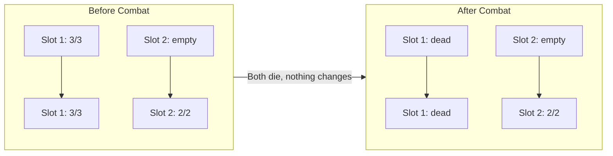
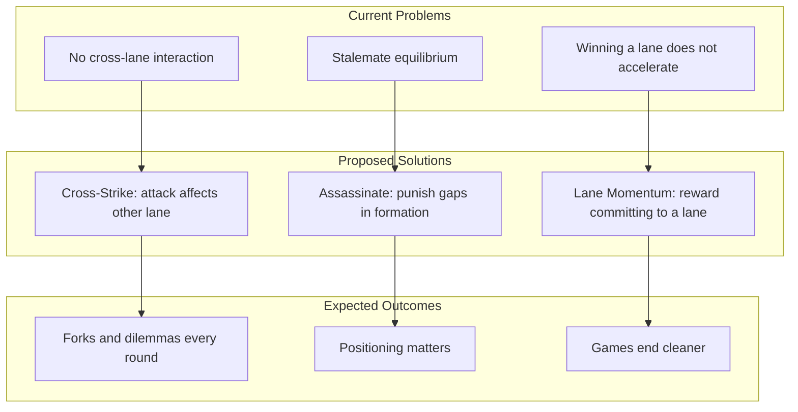

# 2-Lane Positioning, Combat Texture, and Mechanic Surgery

## 1. Root Cause Diagnosis

The 2-lane system feels closed and grindy due to three compounding problems:

### Primary Cause: No Cross-Lane Interaction

Current state:

- Units in Lane A only affect Lane A
- Units in Lane B only affect Lane B
- The only "cross-lane" decision is hero deployment/bouncing
- Result: Two parallel solitaire games

**Why this matters in 2 lanes:**

In 3-lane systems, the "third lane" often acts as a pivot point or pressure valve. With 2 lanes, there is no pressure release - both lanes must be won, and neither lane affects the other during combat.

### Secondary Cause: Combat Creates Stalemate Equilibrium

Current combat (`resolveSimultaneousCombat` in [src/game/combatSystem.ts](src/game/combatSystem.ts)):

- Units in same slot trade simultaneously
- Empty slots deal tower damage
- After combat, surviving units often mirror pre-combat positions
- Result: "Same board, same fight" loops



### Tertiary Cause: Win Condition Doesn't Reward Tempo

Current win condition (from [src/game/types.ts](src/game/types.ts)):

- Tower HP: 15 per tower
- Nexus HP: 30
- Must destroy both towers OR reduce nexus to 0
- Overflow damage goes to nexus after tower dies

**Problem:** Winning one lane early doesn't accelerate winning the second lane. The player who wins Lane A first just... continues fighting in Lane B at the same pace. No snowball, no tempo advantage that matters.

---

## 2. Win Condition Evaluation

### Recommended Structure: Aggregate Tower HP with Overflow Acceleration

**Proposed win condition:**

- Win by reducing opponent's **total tower HP + nexus HP** to 0
- Towers: 20 HP each (total 40)
- Nexus: 30 HP
- When a tower dies, all subsequent damage to that lane goes directly to nexus
- **New: Dead tower = +50% overflow damage** (already implemented in previous turn)

**Why this reduces grind:**

- Players can focus pressure on one lane to "break through" faster
- Once a tower falls, that lane becomes a nexus-burning engine
- Creates "which lane do I abandon" decisions

**How it affects snowballing:**

- Moderate snowball: losing a tower is bad, but 30 nexus HP is still a buffer
- The +50% overflow bonus creates meaningful acceleration without being oppressive

**How it affects comeback potential:**

- Comeback through: stabilize the broken lane (redeploy heroes), pressure opponent's weaker lane
- Not hopeless: 30 nexus HP + remaining tower gives time to stabilize
- Counterplay: Assassin-type units (proposed below) can punish overcommitment

**Implementation note:** Overflow escalation already exists in [src/game/combatSystem.ts](src/game/combatSystem.ts) lines 487-490. Just ensure it is working correctly.

---

## 3. Proposed Mechanics (2-3 Total)

### Mechanic 1: Cross-Strike (Highest Priority)

**Rules Text:**

> **Cross-Strike:** When this unit attacks an empty slot, it deals 2 damage to the enemy unit in the same slot on the OTHER battlefield (if any). If no unit there, deals 2 damage to that tower.

**Why it creates meaningful choices in 2 lanes:**

- Creates a "fork": opponent must decide which lane to block
- Punishes over-concentration in one lane
- Rewards spreading units across lanes to defend
- Makes positioning in Lane A affect Lane B

**Example Scenario:**

```
Lane A: You have 4/4 in Slot 3, opponent has nothing
Lane B: Opponent has 3/3 in Slot 3, you have nothing

Without Cross-Strike: Your 4/4 hits tower A for 4
With Cross-Strike: Your 4/4 hits tower A for 4 AND deals 2 to enemy 3/3 in Lane B

Opponent's dilemma: Block in Lane A (stops tower damage) or move to Lane B (protects the 3/3)?
```

**Counterplay Pattern:**

- Spread units across both lanes to avoid empty-slot exploitation
- Use "wide" strategies instead of "tall" stacking
- Prioritize killing Cross-Strike units

**Balance Knobs:**

- Cross-Strike damage: 2 (current proposal), could be 1-3
- Rarity: Uncommon/Rare - not on every unit
- Distribution: 4-6 cards with Cross-Strike in the pool
- Heroes with Cross-Strike should be limited (1-2 max)

**Cleave Interaction:**

- Cleave remains as-is (damages adjacent in SAME lane)
- Cross-Strike is orthogonal (damages ACROSS lanes)
- Both can coexist; a unit with both would be very rare/expensive

### Mechanic 2: Assassinate (Medium Priority)

**Rules Text:**

> **Assassinate:** If this unit has no enemy unit in front of it, it may target any enemy unit in this lane instead of the tower.

**Why it creates meaningful choices in 2 lanes:**

- Punishes leaving gaps in formation
- Creates "answer or die" threats
- Rewards positioning blockers in front of valuable units
- Forces opponent to consider slot arrangement, not just unit count

**Example Scenario:**

```
Your side:  Slot 1: Assassin (3/2), Slot 2: empty
Their side: Slot 1: empty, Slot 2: empty, Slot 3: Hero (4/6)

Without Assassinate: Your Assassin hits tower for 3
With Assassinate: Your Assassin kills their Hero for 3 damage

Opponent's response: Must place a blocker in Slot 1 to protect backline
```

**Counterplay Pattern:**

- Place "taunt" or "blocker" units in front slots
- Don't leave gaps in your formation
- Trade assassins early before they can exploit gaps

**Balance Knobs:**

- Assassin units typically: low health (2-3), moderate attack (3-4)
- Rarity: Uncommon - available but not ubiquitous
- Distribution: 3-5 cards with Assassinate
- Cannot target heroes if "taunt" units exist (potential future mechanic)

### Mechanic 3: Lane Momentum Bonus (Low Priority / Optional)

**Rules Text:**

> When you deal 10+ cumulative tower damage to a lane (tracked in `laneMomentum`), your units in that lane gain +1 attack.

**Why it creates meaningful choices:**

- Rewards committing to a lane
- Creates snowball without being immediate
- Gives defender urgency to stabilize
- Makes "which lane to win" decision matter more

**Example Scenario:**

```
Turn 1-3: You've dealt 12 total damage to Tower A
Turn 4: Your units in Lane A now have +1 attack
       Opponent must decide: reinforce Lane A or abandon it?
```

**Counterplay Pattern:**

- Spread pressure to prevent hitting threshold
- Prioritize defending the lane closer to threshold
- Use removal on high-attack units before they snowball

**Balance Knobs:**

- Threshold: 10 damage (current), could be 8-15
- Bonus: +1 attack (current), could be +1/+0 or just +1 attack
- Caps at one threshold (no further bonuses at 20, 30, etc.)

**Implementation note:** `laneMomentum` tracking already exists in [src/game/types.ts](src/game/types.ts) lines 144-148, but the bonus is not currently applied. This was removed in the previous session.

---

## 4. Cleave Evaluation

**Current State:**

- Cleave exists in card descriptions but is **NOT implemented in combat resolution**
- `resolveSimultaneousCombat` does not check for cleave or apply adjacent damage
- Cards like "Cleaving Warrior" are effectively vanilla units

**Recommendation: Implement Cleave Properly, Then Evaluate**

Before deciding if Cleave is too strong:

1. Implement cleave in `resolveSimultaneousCombat`
2. Test with 5 slots per lane
3. Observe if it dominates or creates interesting trades

**Proposed Cleave Implementation:**

> **Cleave:** When this unit attacks a unit, it also deals its attack damage to units in adjacent slots (slot-1 and slot+1).

If Cleave proves too strong in 2 lanes:

- Reduce cleave damage to 50% of attack
- Limit cleave to only one adjacent slot (left OR right, player's choice)
- Make cleave rare (only 2-3 cards in pool)

---

## 5. Mechanics to Cut or De-emphasize

### Cut Immediately

| Mechanic | Location | Reason |

|----------|----------|--------|

| **Saga System** | [src/game/sagaSystem.ts](src/game/sagaSystem.ts) | Adds chapter tracking without meaningful play; complex for no clear benefit |

| **Chromatic Payoff** | [src/game/chromaticSystem.ts](src/game/chromaticSystem.ts) | Interesting but secondary; postpone until core combat is solid |

| **Blood Magic** | Various heroes | Too complex for MVP; removed in Plan A but may have remnants |

| **Equipment Artifacts** | [src/game/equipmentSystem.ts](src/game/equipmentSystem.ts) | Adds inventory management; postpone |

### De-emphasize (Keep but Don't Expand)

| Mechanic | Reason |

|----------|--------|

| **Stun** | Useful control tool, but don't add more stun cards |

| **Tower Armor** | Exists but rarely matters; don't add more armor cards |

| **Barrier** | One-turn immunity is fine; don't make it common |

### Keep As-Is

| Mechanic | Reason |

|----------|--------|

| **Ranged Attack** | Cross-lane damage from base; creates positioning tension |

| **Fight** | RG identity; on-deploy removal is good |

| **Rune Death** | Core mechanic; already implemented |

---

## 6. MVP Implementation Plan

### Change 1: Implement Cross-Strike (Highest Leverage)

**What to implement:**

- Add `crossStrike?: number` field to `GenericUnit` and `Hero` in [src/game/types.ts](src/game/types.ts)
- Modify `resolveSimultaneousCombat` in [src/game/combatSystem.ts](src/game/combatSystem.ts) to check for cross-strike when attacking tower
- When attacking tower (empty slot), deal `crossStrike` damage to enemy unit in same slot on OTHER battlefield

**Systems touched:**

- [src/game/types.ts](src/game/types.ts) - Add field
- [src/game/combatSystem.ts](src/game/combatSystem.ts) - Add logic in `resolveSimultaneousCombat`
- [src/game/comprehensiveCardData.ts](src/game/comprehensiveCardData.ts) - Add 4-6 Cross-Strike units

**Test plan:**

1. Create a game with a Cross-Strike unit in Slot 3, Lane A
2. Leave enemy Slot 3 empty in Lane A
3. Place enemy unit in Slot 3, Lane B
4. Resolve combat
5. Verify: Tower A takes normal damage AND enemy unit in Lane B takes 2 damage

**Success criteria:**

- "I set up a threat you must answer" moments occur regularly
- Players consider both lanes when placing units
- Cross-Strike units are drafted with intent, not ignored

### Change 2: Implement Assassinate (Medium Leverage)

**What to implement:**

- Add `assassinate?: boolean` field to `GenericUnit` and `Hero`
- Modify `getDefaultTarget` in [src/game/combatSystem.ts](src/game/combatSystem.ts) to select a valid enemy unit in lane (instead of tower) if attacker has `assassinate` and no blocker

**Systems touched:**

- [src/game/types.ts](src/game/types.ts) - Add field
- [src/game/combatSystem.ts](src/game/combatSystem.ts) - Modify target selection
- [src/game/comprehensiveCardData.ts](src/game/comprehensiveCardData.ts) - Add 3-5 Assassin units

**Test plan:**

1. Create a game with an Assassin unit in Slot 1
2. Leave enemy Slot 1 empty
3. Place enemy hero in Slot 5
4. Resolve combat
5. Verify: Assassin targets and damages enemy hero, not tower

**Success criteria:**

- Players place blockers intentionally to protect backline
- Assassin units create "must answer" situations
- Formation gaps are punished

### Change 3 (Optional): Re-enable Lane Momentum Bonus

**What to implement:**

- Uncomment/re-add `getLaneMomentumBonus` in [src/game/combatSystem.ts](src/game/combatSystem.ts)
- Apply bonus when `laneMomentum[lane][player] >= 10`
- Bonus: +1 attack to all units in that lane

**Systems touched:**

- [src/game/combatSystem.ts](src/game/combatSystem.ts) - Re-add function and calls
- No new types needed (laneMomentum already exists)

**Test plan:**

1. Deal 10+ damage to Tower A across multiple turns
2. Verify units in Lane A gain +1 attack
3. Verify Lane B units do NOT gain bonus

**Success criteria:**

- Players feel momentum building when winning a lane
- Defenders feel urgency to stabilize before threshold
- Bonus is noticeable but not game-ending

---

## 7. Summary



**Decisive changes in priority order:**

1. **Cross-Strike** - Creates the "third lane" effect without adding a lane
2. **Assassinate** - Makes slot placement matter beyond "unit vs empty"
3. **Lane Momentum** (optional) - Rewards lane commitment, creates urgency

**What to cut:**

- Saga system (complex, low impact)
- Chromatic payoff (postpone)
- Equipment artifacts (postpone)

**What success looks like:**

- Players think about both lanes when deploying a single unit
- Empty slots are dangerous, not just "free tower damage"
- Games resolve in 6-8 turns with clear winners, not 12-turn grinds