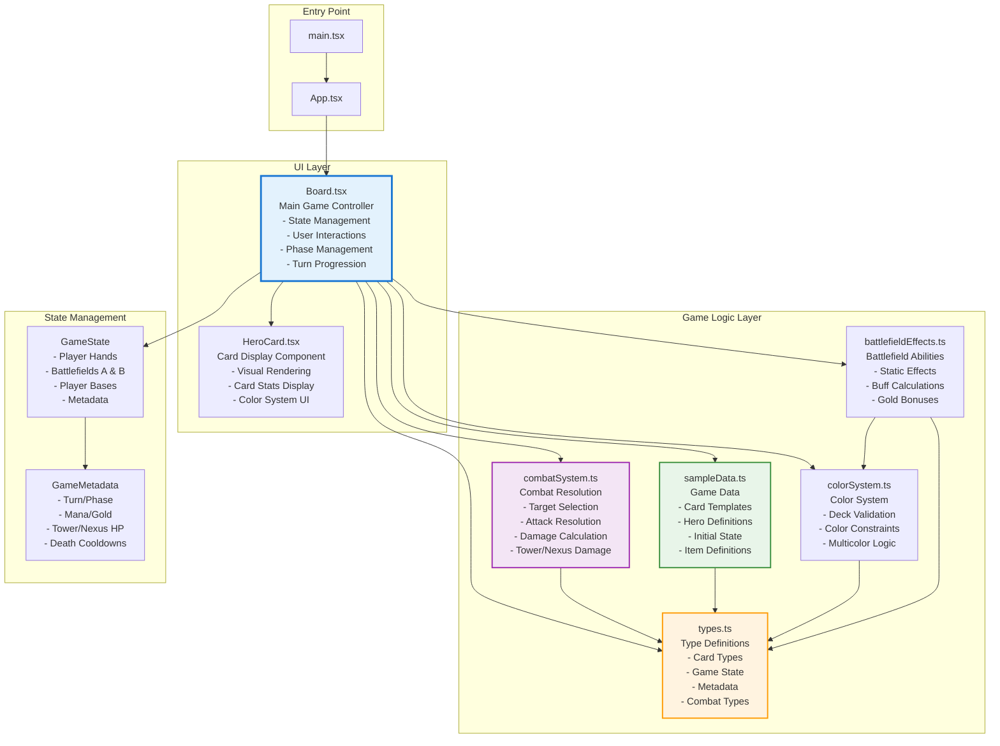

# Artibound - Software Architecture Diagram

> **Created:** 2024-12-XX  
> **Last Updated:** 2024-12-XX  
> **Status:** Active  
> **Relevance:** High  
> **Category:** Architecture  
> **Notes:** Technical architecture documentation

## System Overview

Artibound is a two-player hero card game built with React + TypeScript. The architecture follows a component-based structure with clear separation between UI components and game logic.

## Architecture Diagram



## Component Responsibilities

### UI Components

#### `Board.tsx` (Main Controller)
- **State Management**: Manages all game state via React hooks
  - `gameState`: Complete game state (hands, bases, battlefields)
  - `metadata`: Turn, phase, mana, gold, HP tracking
  - `selectedCardId`: Currently selected card for actions
  - `combatTargetsA/B`: Combat target assignments
- **User Interactions**: Handles all player actions
  - Card deployment (hand/base → battlefield)
  - Combat target selection
  - Item shop interactions
  - Card creation/editing
- **Phase Management**: Orchestrates turn structure
  - Play Phase → Combat A → Adjust → Combat B → Next Turn
  - Mana regeneration
  - Gold generation
  - Death cooldown management
- **Game Logic Orchestration**: Calls game logic modules
  - Combat resolution via `combatSystem.ts`
  - Color validation via `colorSystem.ts`
  - Battlefield effects via `battlefieldEffects.ts`

#### `HeroCard.tsx` (Presentation)
- **Visual Rendering**: Displays card information
  - Card type, name, description
  - Stats (attack, health, mana cost)
  - Color indicators
  - Special abilities
- **State Display**: Shows card state
  - Death cooldown overlay
  - Played spell overlay
  - Stacked generic units
  - Selected state highlighting

### Game Logic Modules

#### `types.ts` (Type System)
- **Core Types**: All game entity definitions
  - `Card`: Union type (Hero | SignatureCard | HybridCard | GenericUnit | SpellCard)
  - `GameState`: Complete game state structure
  - `GameMetadata`: Turn/phase/resource tracking
  - `Battlefield`: Player unit arrays
- **Combat Types**: Combat system definitions
  - `AttackTarget`: Unit or tower targeting
  - `CombatAction`: Attack action structure
- **System Constants**: Game rules
  - `BATTLEFIELD_SLOT_LIMIT = 5`
  - `TOWER_HP = 20`
  - `NEXUS_HP = 30`

#### `combatSystem.ts` (Combat Resolution)
- **Target Selection**: Determines default/valid targets
  - `getDefaultTarget()`: Positional targeting (same slot)
  - `getDefaultTargets()`: All units' default targets
  - `canTarget()`: Target validation
- **Combat Resolution**: Processes attacks
  - `resolveAttack()`: Single attack resolution
  - `resolveCombat()`: Full battlefield combat
  - Handles unit deaths, tower damage, overflow to nexus

#### `sampleData.ts` (Game Data)
- **Card Templates**: All available cards
  - Hero templates (Warrior, Mage, etc.)
  - Signature cards (2 per hero)
  - Generic units (player-specific)
  - Spell cards
  - Multicolor cards
- **Initial State**: Starting game configuration
  - `createInitialGameState()`: Sets up turn 1 state
  - `createCardLibrary()`: Player-specific card pools
  - `createCardFromTemplate()`: Card instantiation

#### `colorSystem.ts` (Deck Building Rules)
- **Color Validation**: Enforces deck constraints
  - `validateDeckColors()`: Max 3 colors per deck
  - `canPlayCardInLane()`: Color requirement checking
- **Color Utilities**: Helper functions
  - `getUniqueColors()`: Extract colors from cards
  - `hasNUnitsOfSameColor()`: Battlefield effect checks

#### `battlefieldEffects.ts` (Static Abilities)
- **Effect Application**: Applies battlefield bonuses
  - `applyBattlefieldEffect()`: Main effect handler
  - `applySameColorBuff()`: +1/+0 buff logic
  - `calculateGoldOnKillBonus()`: Gold rewards
- **State Queries**: Checks effect activation
  - `isBattlefieldEffectActive()`: Effect status
  - `getBattlefieldEffectIndicator()`: UI feedback

## Data Flow

### Game State Flow
```
User Action (Board.tsx)
    ↓
State Update (setGameState)
    ↓
Game Logic Validation (combatSystem/colorSystem)
    ↓
State Mutation (Immutable Updates)
    ↓
UI Re-render (React)
```

### Combat Flow
```
Combat Phase Start
    ↓
Get Default Targets (combatSystem.getDefaultTargets)
    ↓
User Override Targets (Optional)
    ↓
Resolve Combat (combatSystem.resolveCombat)
    ↓
Update Battlefield State
    ↓
Apply Tower/Nexus Damage
    ↓
Update Game State
```

### Card Deployment Flow
```
Select Card (Board.tsx)
    ↓
Choose Location (battlefieldA/B, base)
    ↓
Validate (Mana, Slots, Color Requirements)
    ↓
Create Card Instance (sampleData.createCardFromTemplate)
    ↓
Update Game State
    ↓
Deduct Mana
```

## Key Design Patterns

### 1. **Immutable State Updates**
- All state changes use spread operators (`{...prev, ...updates}`)
- Prevents accidental mutations
- Enables React's efficient re-rendering

### 2. **Separation of Concerns**
- UI logic in `Board.tsx`
- Game rules in separate modules (`combatSystem.ts`, `colorSystem.ts`)
- Type definitions centralized in `types.ts`

### 3. **Template-Based Card Creation**
- Cards defined as templates in `sampleData.ts`
- Instantiated with `createCardFromTemplate()`
- Allows easy card library expansion

### 4. **Functional Game Logic**
- Pure functions for combat resolution
- No side effects in game logic modules
- Easy to test and reason about

## State Structure

### GameState
```typescript
{
  player1Hand: Card[]
  player2Hand: Card[]
  player1Base: Card[]
  player2Base: Card[]
  battlefieldA: { player1: Card[], player2: Card[] }
  battlefieldB: { player1: Card[], player2: Card[] }
  metadata: GameMetadata
}
```

### GameMetadata
```typescript
{
  currentTurn: number
  activePlayer: 'player1' | 'player2'
  currentPhase: 'play' | 'combatA' | 'adjust' | 'combatB'
  player1Mana: number
  player2Mana: number
  player1MaxMana: number
  player2MaxMana: number
  player1Gold: number
  player2Gold: number
  player1NexusHP: number
  player2NexusHP: number
  towerA_HP: number
  towerB_HP: number
  deathCooldowns: Record<string, number>
  player1MovedToBase: boolean
  player2MovedToBase: boolean
  playedSpells: Record<string, boolean>
}
```

## Module Dependencies

```
Board.tsx
  ├── types.ts (all types)
  ├── combatSystem.ts (combat resolution)
  ├── sampleData.ts (card templates, initial state)
  ├── colorSystem.ts (color validation)
  └── battlefieldEffects.ts (static abilities)

combatSystem.ts
  └── types.ts

sampleData.ts
  └── types.ts

colorSystem.ts
  └── types.ts

battlefieldEffects.ts
  ├── types.ts
  └── colorSystem.ts

HeroCard.tsx
  └── types.ts
```

## Current Features

✅ **Implemented**
- Two-player turn-based gameplay
- Dual battlefield system (A & B)
- Mana system (3-10, +1 per turn)
- Gold economy with item shop
- Combat system with positional targeting
- Color system (max 3 colors per deck)
- Hero deployment and movement
- Death cooldown system
- Spell cards with effects
- Item system (equip to heroes)
- Phase system (play → combatA → adjust → combatB)
- Tower/Nexus HP tracking
- Card library system (player-specific)
- Generic unit stacking
- Battlefield slot system (5 slots per side)

🚧 **Planned (Not Yet Implemented)**
- Draft system (hero/battlefield selection)
- Battlefield static abilities (partially implemented)
- Spell effect resolution
- AI opponent (for PVE mode)

## Architecture Strengths

1. **Clear Separation**: UI and game logic are well-separated
2. **Type Safety**: Comprehensive TypeScript types prevent errors
3. **Modularity**: Game logic modules are independent and testable
4. **Extensibility**: Easy to add new card types, effects, or systems
5. **State Management**: Centralized state in Board component

## Potential Improvements

1. **State Management**: Consider Redux/Zustand for complex state
2. **Component Splitting**: Board.tsx is large (1960 lines) - could split into smaller components
3. **Game Logic Extraction**: Move more logic out of Board.tsx into dedicated modules
4. **Testing**: Add unit tests for game logic modules
5. **Performance**: Memoization for expensive computations

